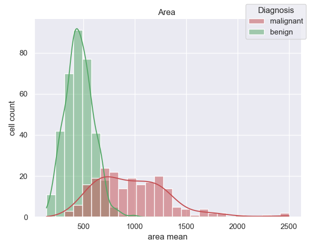
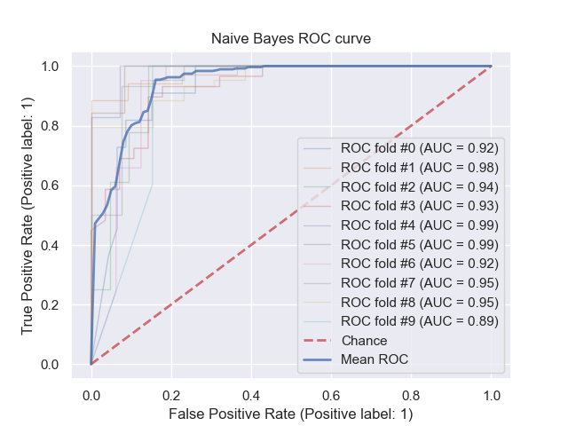

# Breast Cancer Diagnosis Predictions and Data Visualizations  

This project uses [UCI's Wisconcin Breast Cancer Diagnosis dataset](https://archive.ics.uci.edu/ml/datasets/Breast+Cancer+Wisconsin+%28Diagnostic%29) to train 4 distinct classifier models:  
- a linear SVC model
- a Naive Bayes model
- a Logistic Regression model
- and an XGBoost classifier model  

These types of models were chosen as they are all known to be highly effective at binary classification problems. In fact, [this paper](https://ieeexplore.ieee.org/abstract/document/9077811) claimed that a linear SVC was the most accurate model for this exact problem with this dataset. The paper did not include an XGBoost model in its analysis, so I thought I'd put that claim to the test.  

## Model Training

The main script in this repository is **train_cancer_models.py**, this program:
- splits the dataset into training and testing sets
- trains, tests, and k-fold cross validates each model on 10 folds
- generates a ROC curve for each model (can be found in the pngs folder)
- prints some basic metrics for each model (accuracy, precision, and recall)  

For those who do not want to run the train_cancer_models script, here are the resulting metrics (average over 10 folds):  

| MODEL               | ACCURACY | PRECISION | RECALL |
|---------------------|----------|-----------|--------|
| Linear SVC          |  95.08%  |   93.60%  | 97.27% |
| Naive Bayes         |  89.64%  |   85.46%  | 97.35% |
| Logistic Regression |  95.26%  |   93.41%  | 97.56% |
| XGBoost             |  97.72%  |   96.56%  | 98.93% |

## Data Analysis and Visualization 

The other two scripts, **visualize_cancer_data.py** and **create_subplots.py** are used to create the clean Seaborn histograms that represent this dataset's feature distributions (also found in the pngs folder). These scripts are extremely helpful for tuning the models as they provide a quick and simple start to Exploratory Data Analysis. Using these plots, a hypothesis could easily be made and tested during feature engineering and feature selection.  

Here's an example of one of the histograms:  

And here's an exapmle of one of the ROC curves:  

